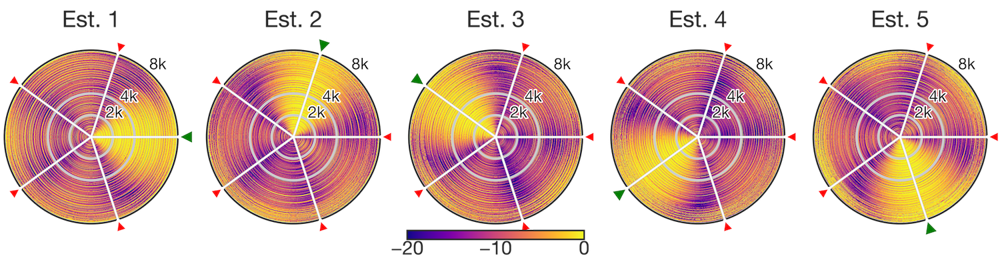
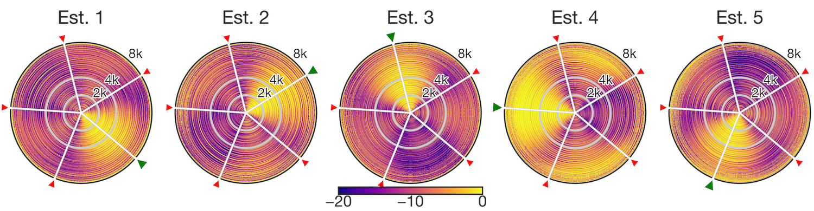

## Responses to Reviewers' Comments (SIP-2023-0063)

Dear Associate Editor and Reviewers,

Thank you very much for your constructive suggestions and valuable comments on our paper entitled "Self-Rotation-Robust Online-Independent Vector Analysis with Sound Field Interpolation on Circular Microphone Array" `(SIP-2023-0063)`.
We have carefully revised the manuscript according to the comments.

We will provide a point-by-point reply that explains the reviewers' comments.
The notations and citations used in this letter are the same as in the revised manuscript.

For the convenience of the reviewers, we have also included the difference between the corrected manuscript and the original manuscript.
In the differences, the added parts are indicated in blue, and the deleted parts in red.

## Responses to Reviewer 1

> 1. The basic signal model in (1) does not consider any background noise, and neither does the simulation.
>    From a practical point of view, background noise is inevitable.
>    Therefore, it is essential to demonstrate the performance of the proposed algorithms under various noise conditions.
>    Alternatively, please consider validating the proposed algorithms through real experiments.

Thank you for your constructive comments.
As pointed out, we acknowledge that it is important to show the results of experiments in noisy environments from a practical point of view.
Additional experiments were performed under the following two conditions:

1. One extra interference
2. Speech babble noise

For detailed experimental conditions, results, and discussions, please see **Subsection 5.2** in the revised edition.
As for experiments under real environments, due to time constraints, we decided to leave it for future work and have added to the conclusions of the revised manuscript.

> 2. Figure 6 is difficult to view, particularly when printed in greyscale.
>    Another figure that supports your conclusion in a clearer manner may be beneficial.

Thank you for your suggestion.
We considered adding another figure, but it was not easy.
Therefore, instead, we made the following modifications to improve the clarity of the figures.

- Moved the color bar to the bottom
- Deleted the numbers indicating the source directions
- Added a green triangle and small red triangles to indicate the directions of the target source and the interference sources, respectively. We think the difference in the size of triangles improves the clarity in greyscale.

<figure>
  
  <figcaption style="text-align:center">(a) Before rotation.</figcaption>
   
  
  <figcaption style="text-align:center">(b) SFIIVA-O after rotation.</figcaption>
   
  
  <figcaption style="text-align:center">(c) SFIIVA-M after rotation.</figcaption>
   
  <figcaption style="text-align:center">Fig 12: Beam patterns of demixing matrices. The five plots are the beam patterns of the frequency-wise demixing matrices calculated by each method. The radial direction of each plot represents the frequency, and the tangential direction represents the angle from the center of the CMA. The light and dark colors represent the gain in decibels. The five triangles in each plot indicate the true direction of the source, with green representing the target source and red the interfering source.</figcaption>
</figure>

> 3. The current simulation setup adopts the same number of sources and microphones.
>    It presents a determined case in math.
>    How about other combinations of $K$ and $M$ to demonstrate the under-determined and over-determined cases?

We recognize that the reviewer's question is natural.
However, historically, BSS research had started with a scenario of the determined case, later progressing to underdetermined or overdetermined cases.
The purpose of this paper is to make BSS robust against the self-rotation of the microphone array.
To maintain a clear focus on this purpose, we would like to keep the determined case in this paper, and we will investigate other conditions in future work.

> Furthermore, typos are noted in this paper.
> For instance, in the third paragraph of the introduction, it should be "relation" instead of "realation."
> Please review the paper carefully for such errors when revising.

Thank you for your suggestion.
We have carefully corrected that typo and other minor errors.
We also plan to have it professionally proofread by a native English speaker if the paper is accepted.

## Responses to Reviewer 2

> It might be good to include a simple system diagram illustrating the key components of the proposed approach (e.g. similar to Figure 1 in [22]).

Thank you for your recommendation.
We have added a new figure (Figures 3 and 4 in the revised manuscript).

> On Page 4, after mentioning that the rotation angle is assumed to be measured by a sensor it might be good to also mention an example (e.g. an angular acceleration sensor as mentioned later at the end of Section 3).

Thank you for pointing out an unclear point.
We have added an example of the sentence at the end of the first paragraph in Section 2 (Page 4 in the revised manuscript).

> In Figure 3, (b) and (c) appear to be identical.
> Please clarify if this is intended.

The two figures (Figure 3 (b) and (c) in the first manuscript) showed the placement before and after the rotation of the circular microphone array.
Therefore, the microphone positions in the figures are different.
However, we agree these figures are similar and confusing.
Then, we merged the two figures into a new figure (Figure 4 (b) in the revised manuscript) to show the rotation more clearly.

> Please also clarify what the numbers refer to next to the square outlining the CMA i.e. 3.025, 3.000 and 2.975 in the vertical direction and the 3 numbers in the horizontal direction.

Those numbers in the figure represent the tick labels around the center of the circular microphone array in meters.
However, we agreed that this would complicate the figure and hinder understanding.
Then, we removed the numbers from the figure and added their explanation in the caption of Figure 4(b).

> From results in Figures 4 and 5 it appears that the performance when using a forgetting factor of 0.9 are quite similar for each method.

Thank you for your helpful comment.
In online AuxIVA, setting the forgetting factor $\alpha$ to a smaller value results in faster convergence of the demixing matrices and quicker adaptation to the rotation of the microphone array.
However, the influence of older data diminishes more rapidly, and the equivalent length of data being processed is shortened, which can degrade the separation performance.
We believe each method performs similarly because the separation performance of all methods becomes immediately saturated in this case.
We have added an explanation for this in Section 5.2 (Page 15 of the revised manuscript).

> Please clarify this and also if the error bars, which appear overlapping, represent confidence intervals or some other quantity.

The bars represent the maximum and minimum values, excluding outliers since Figure 5 is a well-known box-and-whisker diagram.
We have added an explanation for that to the figure caption in the revised manuscript.

> In the first sentence of Section 5.4, it should perhaps say “SFIIVA-O and SFIIVA-M” rather than “SFIIVA-O and SFIIVA-O”.

Thank you for your correction.
We have carefully corrected that.

> In Figure 6 (c), it appears that results for Channel 4 might not be as good a other channels in that while there is a brighter region around 176 degrees other regions also appear relatively bright (e.g. between 248 and 320 degrees).
> Please consider commenting on why this might be the case.

Thank you for your insightful comment.
Online AuxIVA adaptively steers nulls to suppress interference sources at each frequency.
However, the nulls may not be precisely formed in some frequency bands where the source signal is inherently weak because it does not affect the separated signal very much.
We suppose the beam pattern for Est. 4 with insufficient nulls in Fig. 12(c) might happen since the 4th separated signal in high-frequency bands was accidentally weak.
